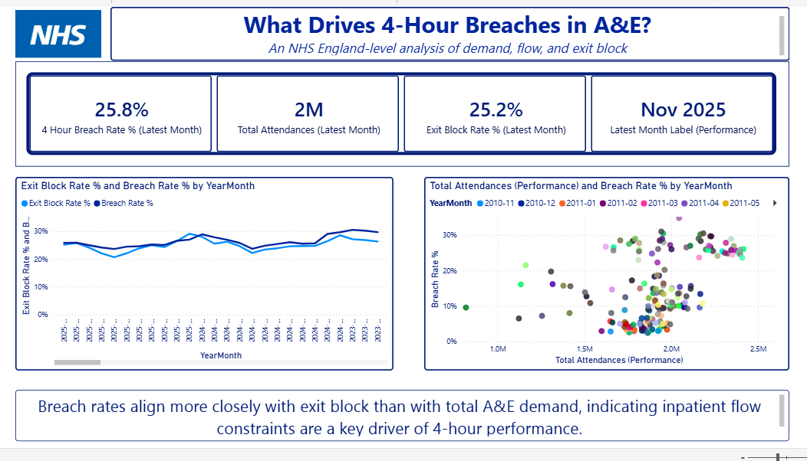

# What Drives 4-Hour Breaches in A&E?

An NHS England–level Power BI analysis exploring what most strongly aligns with A&E 4-hour breach performance, focusing on the relationship between demand, patient flow, and exit block.

---

## Key Insight

Breach rates align more closely with exit block (post-decision-to-admit delays) than with total A&E attendances, indicating that inpatient flow constraints are a key driver of 4-hour performance deterioration rather than front-door demand alone.

---

## Project Overview

This project was designed to move beyond descriptive reporting and explore *what actually drives variation* in A&E 4-hour performance.

Rather than assuming higher demand automatically leads to worse performance, the analysis compares:
- Time-series trends in breach rates and exit block
- Monthly demand levels against breach rate outcomes

The aim is to support system-level understanding of A&E performance pressures, aligned with how operational discussions take place within NHS Trusts.

---

## Dashboard Highlights

### Latest Month Snapshot
- **4-Hour Breach Rate:** 25.8%
- **Total A&E Attendances:** ~2 million
- **Exit Block Rate:** 25.2%
- **Reporting Period:** November 2025

### Evidence Used
- **Time-series analysis** showing breach rates and exit block moving closely together over time
- **Scatter analysis** demonstrating weak correlation between demand and breach rates at similar attendance levels

---

## Measures (High-Level)

- **4-Hour Breach Rate (%)**  
  Attendances exceeding 4 hours ÷ Total attendances

- **Exit Block Rate (%)**  
  Patients waiting >4 hours post decision to admit ÷ Total emergency admissions

- **Latest Month KPIs**  
  Calculated dynamically using the most recent available month in each fact table

---

## Data Source

This analysis uses **publicly available, aggregated NHS England data**, including:
- Monthly A&E attendance volumes
- 4-hour performance metrics
- Post-decision-to-admit delay statistics

No patient-level or Trust-level identifiable data is used.

_Source:_ NHS England published A&E activity and performance statistics.
https://www.england.nhs.uk/statistics/statistical-work-areas/ae-waiting-times-and-activity/

---

## Tool
Power BI
